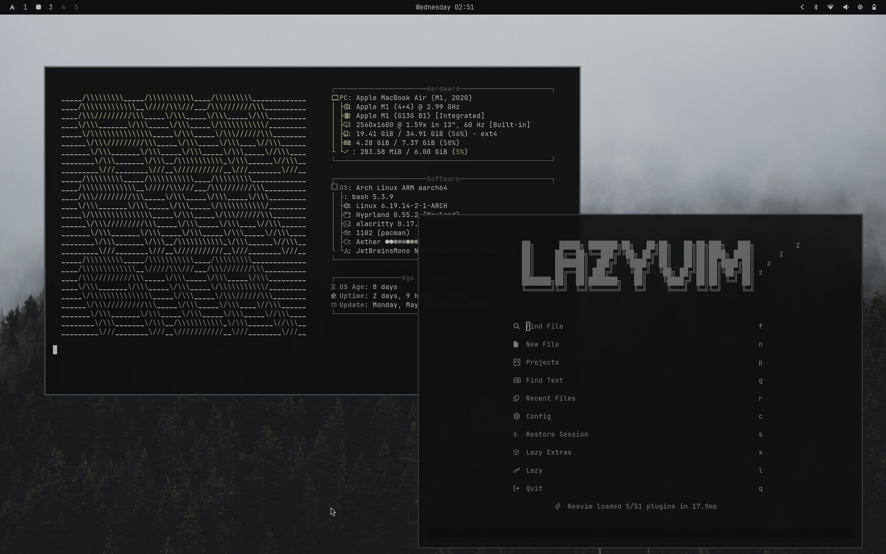

# Sullen Fog

A dark, desaturated theme for Arch Linux. Pure near-black backgrounds with muted greyscale tones — quiet, sunken, and still.



## Install

```bash
omarchy-theme-install https://github.com/newone757/sullen-fog-theme
```

## Colors

| Role       | Hex       |
|------------|-----------|
| Background | `#0f0f0f` |
| Foreground | `#b9b9b9` |
| Accent     | `#686868` |
| Muted      | `#525252` |

## What's included

- Terminal colors (Ghostty, Kitty, Alacritty, Foot)
- Waybar, Walker, Mako, SwayOSD styles
- Hyprland border colors
- Hyprlock colors
- Btop, Wofi, Zellij, Warp themes
- Zed editor theme (`sullen-fog.zed.json`)
- Obsidian theme (`obsidian.css`)
- Neovim colorscheme config (via [aether.nvim](https://github.com/bjarneo/aether.nvim))
- Two wallpapers — cycle with `omarchy-theme-bg-next`

## Wallpapers

| Preview | File |
|---------|------|
| Forest in fog | `a_forest_of_trees_with_fog.jpg` |
| Aerial fog over forest + road | `pexels-daniel-eliashevsky-30667400-13444099.jpg` |
| Aerial fog over dense forest | `pexels-daniel-eliashevsky-30667400-13444097.jpg` |
| Foggy treeline from below | `pexels-eberhardgross-31612214.jpg` |
| Dark foggy forest hillside | `pexels-eberhardgross-1292115.jpg` |
